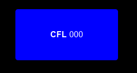
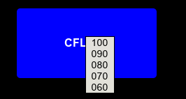
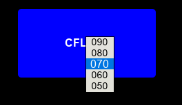
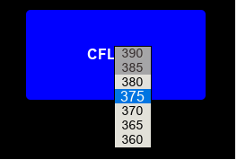

# jqvscroll_widget ([API docs](doc/readme.md))

scrollable selectable widget for ATC simulations

  
  

    <b>Fig01</b>: Inititial form, no CFL value selected yet.
  

  
  

    <b>Fig02</b>: After a "<em>long click</em>", still no CFL value selected.
  

  
  

    <b>Fig03</b>: After a "<em>long clicked</em>" element - <b>070</b> -,  the selected value is centered, and highlighted.  
Then reopened list contains the selected value,  
and focused into the center of the viewport as possible.
  

  
  

    <b>Fig04</b>: After a "<em>long clicked</em>" element - <b>375</b> -,  the selected value is centered, and highlighted.  
Then reopened list contains the selected value,  
and focused into the center of the viewport as possible.  
Operational range maximum value is set at <b>380</b>.  
All above and below the operational minimum values  
the list items disabled.
  

